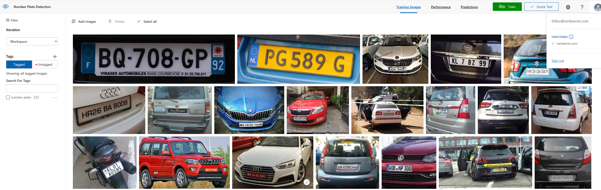
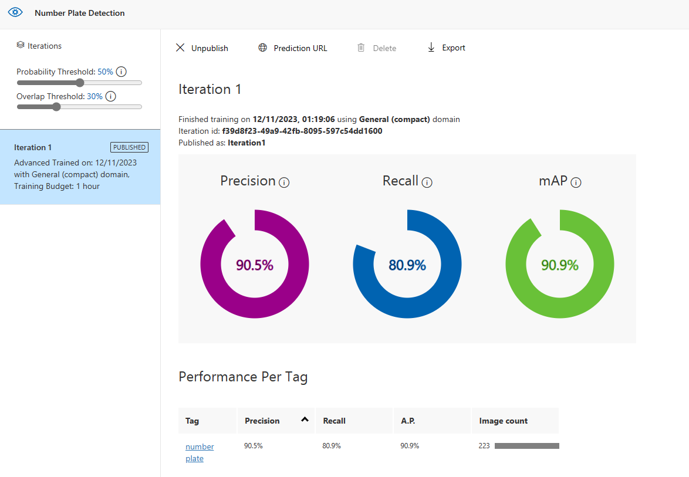

# Automatic Number Plate Recognition (ANPR) System

This project is a proof of concept for a number plate object detection system. It uses Object Detection (OD) to detect number plates in images and then uses OCR to extract the text from the number plate. The project is written in Python with the use of the OpenCV, Tensorflow for OD and Tesseract for OCR libraries.

**DISCLAIMER**  
Since were not AI experts, we trained the OD model on a small dataset of 100 images with the use of Azure Custom Vision. The model is not very accurate and we would recommend training it on a larger dataset for better results. For OCR, we used the default Tesseract model which is not very accurate either. We would recommend training a custom model for better results.

We had many different solutions for this project, but we decided to go with this one after many failed attempts.

## Prerequisites

### OD Model
Because the actual OD model is too large to upload to GitHub, you will need to download it from the following link and place it in the `root` directory: https://drive.google.com/file/d/12YvX-wL4qjB1nsa--Wfxyl4Ti8zpHdSg/view?usp=drive_link

The OD model is named `model.pb`.

How was the OD model trained?
The OD model is trained with the use of Azure Custom Vision. We uploaded dozens of images of number plates and labeled them accordingly. We then trained the model and tested it with new images.
The model is exported as a TensorFlow model and then used in the application.

Azure Custom Vision:


Model metrics (image):



### Operating System

When running this application on a Raspberry Pi, you will need the Raspberry Pi OS **32-bit** image. The 64-bit image does not work with PiCamera.  
A linux operating system is required for this application to work.

## Get Started

### Install Python 3.10

(1) Install dependencies for Pyenc

```bash
sudo apt-get install -y \
    make \
    build-essential \
    libssl-dev \
    zlib1g-dev \
    libbz2-dev \
    libreadline-dev \
    libsqlite3-dev \
    wget \
    curl \
    llvm \
    libncurses5-dev \
    libncursesw5-dev \
    xz-utils \
    tk-dev \
    libffi-dev \
    liblzma-dev \
    git \
    cmake \
    ninja-build \
    libatlas-base-dev \
    libhdf5-dev \
    libhdf5-103 \
    libopenblas-dev

```

(2) Install Pyenv

```bash
curl https://pyenv.run | bash
```

(3) Add the following to your .bashrc or .zshrc

```bash
export PATH="$HOME/.pyenv/bin:$PATH"
eval "$(pyenv init -)"
eval "$(pyenv virtualenv-init -)"
```

(4) Restart your terminal (or run the following command)

```bash
source ~/.bashrc
```

(5) Install Python 3.10

```bash
pyenv install 3.10.0
pyenv global 3.10.0
```

### Create a virtual environment

(1) Create a virtual environment

```bash
pyenv virtualenv 3.10.0 venv
```

(2) Activate the virtual environment

```bash
pyenv activate venv
```

Later on, you can deactivate the virtual environment with the following command:

```bash
pyenv deactivate
```

### Install dependencies

(1) Install the Python dependencies  
Important: TensorFlow has to be installed before the other dependencies and separatly.

```bash
python3 -m pip install --upgrade https://storage.googleapis.com/tensorflow/mac/cpu/tensorflow-1.12.0-py3-none-any.whl

pip install -r requirements.txt
```

### Run the application

(1) Run the application from the root directory

```bash
# Run the application with the default OpenCV camera
python3 src/main.py

# Run the application with the PiCamera
python3 src/main.py --camera rpi

# Run the application with the OpenCV camera
python3 src/main.py --camera cv2
```


## How it works

### Object Detection

The OD model is trained to detect number plates in images. It is not very accurate, but it is good enough for this project. The OD model is trained with the use of Azure Custom Vision. The model is exported as a TensorFlow model and then used in the application.

#### file: `src/object_detection.py`

(1) Initialization  

Sets up the detection environment with necessary parameters like labels for detection, a threshold for probability, and the maximum number of detections allowed.

ANCHORS, IOU_THRESHOLD, and DEFAULT_INPUT_SIZE are predefined constants used in the detection process.
```python
class ObjectDetection(object):
    ANCHORS = np.array([...])  # Predefined dimensions
    IOU_THRESHOLD = 0.45
    DEFAULT_INPUT_SIZE = 512 * 512

    def __init__(self, labels, prob_threshold=0.10, max_detections=20):
        ...

```

(2) Internal Helper Methods

- Logistic Function: Transforms raw model outputs to probabilities.
- Non-Maximum Suppression (NMS): Reduces overlapping bounding boxes to the most probable one.
- Extract Bounding Box: Processes model outputs into bounding box coordinates and class probabilities.

```python
def _logistic(self, x):
    ...

def _non_maximum_suppression(self, boxes, class_probs, max_detections):
    ...

def _extract_bb(self, prediction_output, anchors):
    ...
```

(3) Orientation Correction

The OD model is trained to detect number plates in a specific orientation. This means that if the number plate is rotated, the OD model will not detect it. To solve this problem, we rotate the image in 90 degree increments and run the OD model on each rotation. We then take the bounding box with the highest probability and use that as the final bounding box.

```python
def _update_orientation(self, image):
    ...
```

(4) Image Prediction Workflow
- Preprocess: Prepares the image for the model (resizing, orientation correction).
- Predict: An abstract method implemented in subclasses for model predictions. (ref: `src/main.py` ``TFObjectDetection`` class)
- Postprocess: Extracts and finalizes the bounding boxes after model prediction.

```python
def predict_image(self, image):
    ...

def preprocess(self, image):
    ...

def predict(self, preprocessed_inputs):
    ...

def postprocess(self, prediction_outputs):
    ...
```

#### file: `src/main.py`

(1) TFObjectDetection Class

The TFObjectDetection class is a specialized version of the ObjectDetection class, tailored for use with TensorFlow. It inherits from ObjectDetection and overrides specific methods to work with TensorFlow models. Here's a breakdown of its components:

- Initialization: Sets up the TensorFlow object detection environment.
    - Inherits from the ObjectDetection class by calling super(TFObjectDetection, self).\__init__(labels).
Initializes a TensorFlow graph (self.graph).
    - Initializes a TensorFlow graph (self.graph).
    - Within this graph, it creates a placeholder for input data. This placeholder is configured to accept a batch of images (the first dimension is 1, indicating a single image), with variable height and width, and 3 color channels (RGB).
    - Imports the TensorFlow graph definition (graph_def) into this graph, mapping the input data placeholder to the graph's input.

- Prediction: Runs the TensorFlow model to predict objects in the image.
    - Converts the preprocessed image to a NumPy array and changes its color channel order from RGB to BGR (since TensorFlow models often expect BGR input).
    - Opens a TensorFlow session using the class's graph.
    - Retrieves the model's output tensor by its name ('model_outputs:0').
    - Runs the session, feeding in the preprocessed image as input, and obtains the output.
    - Returns the first element of the outputs, which is the model's prediction for the input image.


```python
class TFObjectDetection(ObjectDetection):
    """Object Detection class for TensorFlow"""

    def __init__(self, graph_def, labels):
        super(TFObjectDetection, self).__init__(labels)
        self.graph = tf.compat.v1.Graph()
        with self.graph.as_default():
            input_data = tf.compat.v1.placeholder(tf.float32, [1, None, None, 3], name='Placeholder')
            tf.import_graph_def(graph_def, input_map={"Placeholder:0": input_data}, name="")

    def predict(self, preprocessed_image):
        inputs = np.array(preprocessed_image, dtype=np.float64)[:, :, (2, 1, 0)]  # RGB -> BGR

        with tf.compat.v1.Session(graph=self.graph) as sess:
            output_tensor = sess.graph.get_tensor_by_name('model_outputs:0')
            outputs = sess.run(output_tensor, {'Placeholder:0': inputs[np.newaxis, ...]})
            return outputs[0]
```

### Optical Character Recognition (OCR)

Because OCR is very common and there are many libraries available for it, we decided to use Tesseract for this project. Tesseract is an open-source OCR library that is very easy to use. It is not very accurate, but it is good enough for this project.

#### file: `src/main.py`

(1) OCR Function

The OCR function takes an image and a bounding box as input and returns the text within the bounding box. The bounding box is adjusted to fit the image and then the image is cropped to the bounding box. The cropped image is then processed with Tesseract and the text is returned.

```python
def perform_ocr(image, bounding_box):
    # Adjust the bounding box coordinates as necessary
    left = int(bounding_box['left'] * image.width)
    top = int(bounding_box['top'] * image.height)
    width = int(bounding_box['width'] * image.width)
    height = int(bounding_box['height'] * image.height)

    # Crop and process the image for OCR
    roi = image.crop((left, top, left + width, top + height))
    text = pytesseract.image_to_string(roi, config='--psm 6')
    return text
```

### MQTT

MQTT is a lightweight messaging protocol that is used for communication between devices. We used MQTT to send the text from the number plate to the server. The server then processes the text and sends it to the database.

#### file: `src/mqtt_handler.py`

(1) MQTT Handler Class

The MQTT Handler class is used to send messages to the server. It uses the paho-mqtt library to connect to the server and send messages.

```python
class MQTTPublisher:
    def __init__(self, broker_address, port=1883):
        self.client = mqtt.Client()
        self.client.connect(broker_address, port, 60)

    def publish_message(self, topic, message):
        self.client.publish(topic, message)
```

#### file: `src/main.py`

(1) MQTT Initialization

```python
mqtt_publisher = MQTTPublisher(os.getenv('BROKER_ADDRESS'), int(os.getenv('BROKER_PORT', 1883)))
```

### All Together

#### file: `src/main.py`

(1) Main Function

- Argument Parsing: Sets up and parses command-line arguments for camera selection. Two options are available: 'cv2' for regular webcam or 'rpi' for Raspberry Pi Camera.

    ```python
    parser = argparse.ArgumentParser(description='ANPR System')
    parser.add_argument('--camera', help='Select the camera package (cv2 or rpi)', default='cv2')
    args = parser.parse_args()
    ```
- Loading TensorFlow Model and Labels: Loads the TensorFlow model (Graph Definition) and labels from files. Initializes the TFObjectDetection class with these assets.
    
    ```python
    print("Loading model...")
    graph_def = tf.compat.v1.GraphDef()
    with tf.io.gfile.GFile(MODEL_FILENAME, 'rb') as f:
        graph_def.ParseFromString(f.read())

    print("Loading labels...")
    with open(LABELS_FILENAME, 'r') as f:
        labels = [label.strip() for label in f.readlines()]

    od_model = TFObjectDetection(graph_def, labels)
    ```
- Camera Setup and Image Capturing: Based on the selected camera package, sets up the respective camera and captures images continuously.
    Raspberry Pi Camera
    ```python
    if args.camera == 'rpi':
    from picamera.array import PiRGBArray
    from picamera import PiCamera

    camera = PiCamera()
    camera.resolution = (1280, 720)
    camera.framerate = 24
    rawCapture = PiRGBArray(camera, size=(1280, 720))
    time.sleep(0.1)
    # Capture loop
    ```
    OpenCV Camera
    ```python
    else:
    cap = cv2.VideoCapture('/dev/video0')
    cap.set(cv2.CAP_PROP_FOURCC, cv2.VideoWriter_fourcc('M', 'J', 'P', 'G'))
    cap.set(cv2.CAP_PROP_FRAME_WIDTH, 1280)
    cap.set(cv2.CAP_PROP_FRAME_HEIGHT, 720)
    # Capture loop
    ```
- Object Detection and OCR: For each captured image, performs object detection and OCR. If a number plate is detected, the text is printed to the console and send to the server via MQTT.
    ```python
    for frame in camera.capture_continuous(rawCapture, format="bgr", use_video_port=True):
        image = frame.array
        rawCapture.truncate(0)

        # Perform object detection
        predictions = od_model.predict_image(image)
        for prediction in predictions:
            if prediction['probability'] > 0.5:
                # Perform OCR
                text = perform_ocr(Image.fromarray(image), prediction['boundingBox'])
                print(text)

                # MQTT Message
                json_data = {
                    "topic": os.getenv('MQTT_TOPIC'),
                    "description": text + " " + os.getenv('CAMERA_POSITION')
                }
                mqtt_publisher.publish_message(os.getenv('MQTT_TOPIC'), json.dumps(json_data))
    ```


